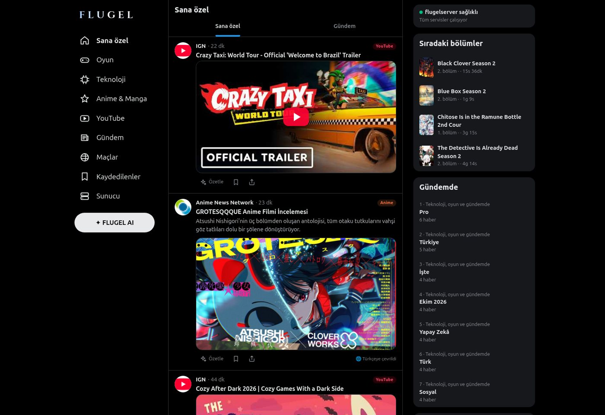
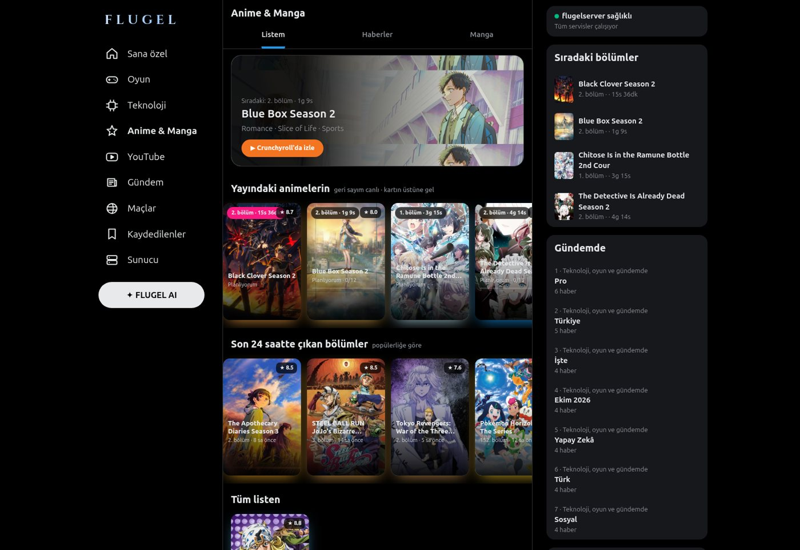
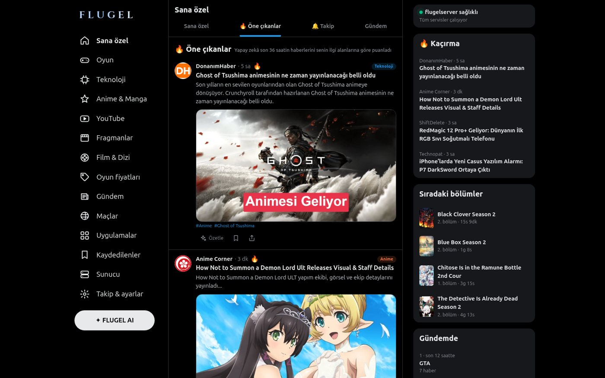
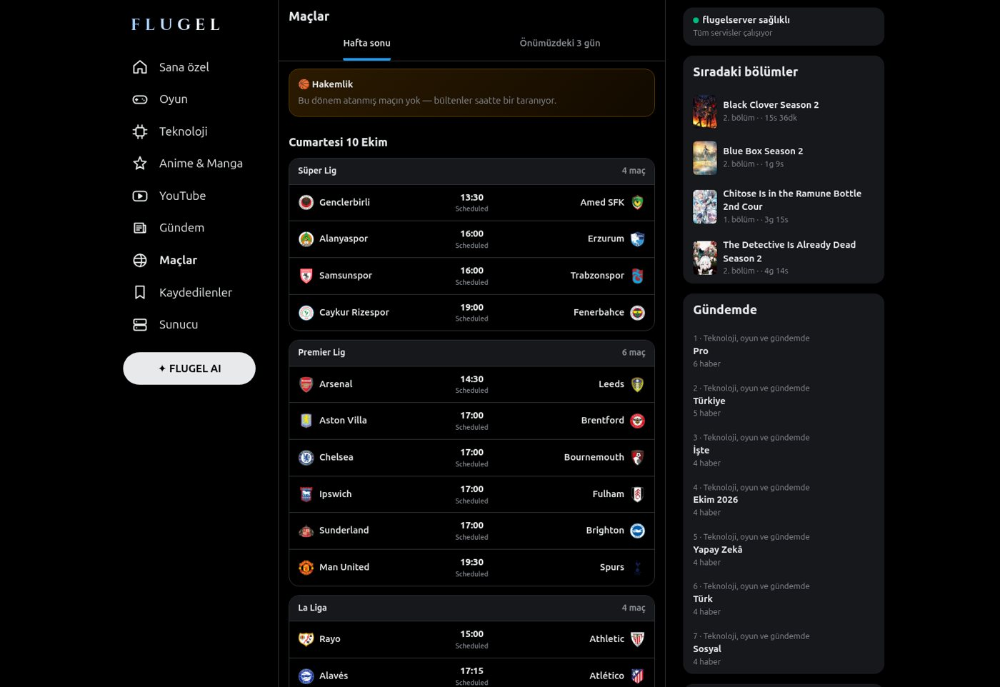
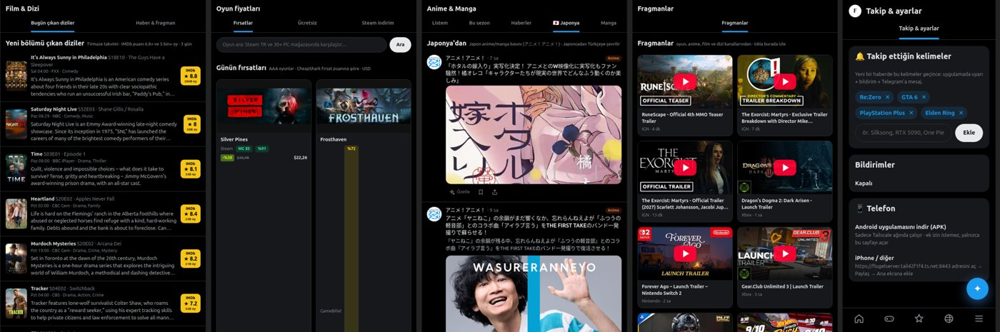
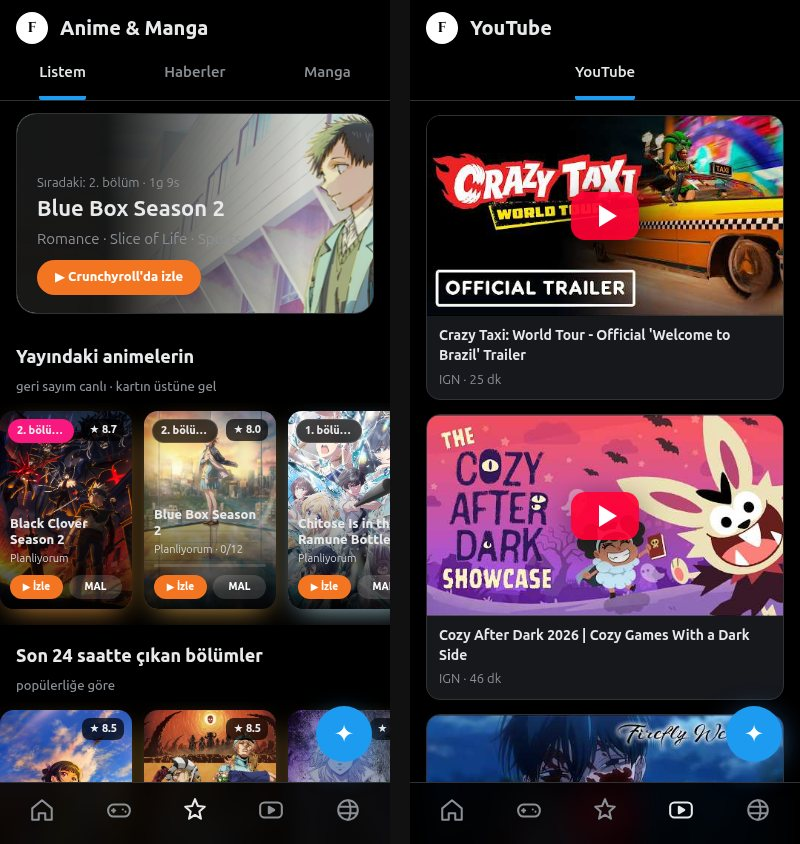
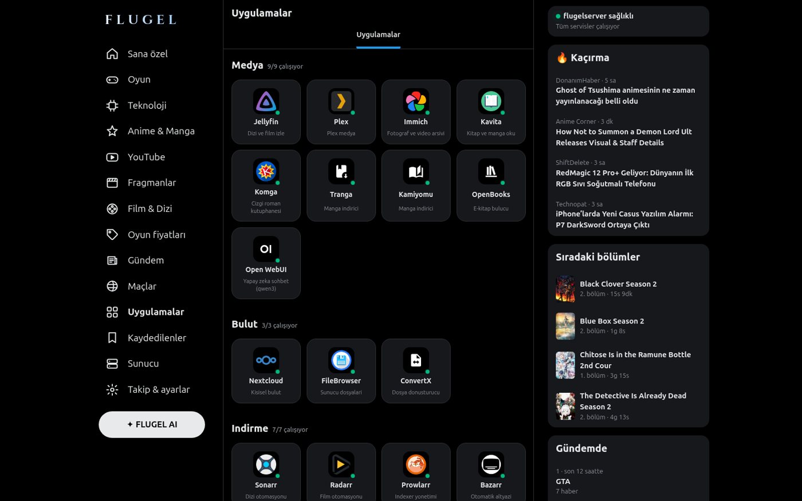
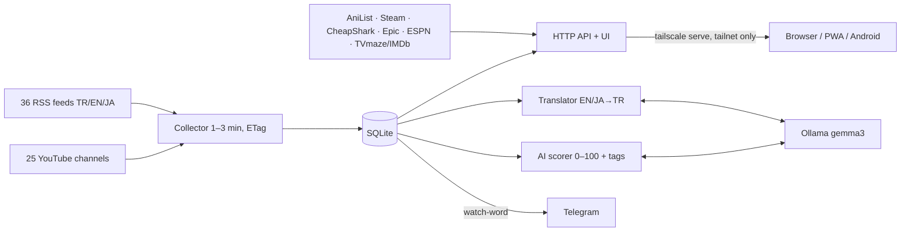

# FLUGEL

**English** · [Türkçe](README.tr.md)

> A personal, self-hosted ecosystem for one laptop and one home server — built around **FLUGEL Akış**, a private
> X-style news & social feed that collects, translates, scores and summarizes everything I care about with a local AI.

<p align="center">
  
  
</p>

The name comes from **Flügel**, the legendary sage of *Re:Zero*. Everything runs on my own hardware:

| Machine | Role | Stack |
|---|---|---|
| **flugelubuntu** (Lenovo ThinkBook 16p Gen 4, RTX 4060) | laptop | Ubuntu 26.04, GNOME 50 (Wayland), custom GNOME Shell extensions |
| **flugelserver** (Ryzen 5 2600X, GTX 1660 Ti, 15 GB RAM) | home server | Ubuntu 26.04, Docker, libvirt/KVM, Ollama, Tailscale, Cloudflare Tunnel |

## 1. FLUGEL Akış — the personal feed
A single-user web app (`sunucu/panel/akis/`) styled like X in dark mode, fed only by sources I chose and ranked by what I care about. Desktop, installable PWA and Android app.

| Section | What it shows |
|---|---|
| **For you** | Games, tech, anime and YouTube in one infinite feed; new posts slide in live |
| **🔥 Highlights** | Last 36 h of news ranked 0–100 by the local AI for my interests |
| **🔔 Following** | Posts matching my watch-words — also pushed to Telegram |
| **Games** | Turkish game press, PlayStation (Blog, Push Square, PS LifeStyle), IGN/VGC/Eurogamer…; Steam recommendations with review scores |
| **Tech** | Webtekno, DonanımHaber, ShiftDelete, Chip, Technopat, Webrazzi… |
| **Anime & Manga** | My MAL list with covers, live countdowns, *legal* streaming links (Crunchyroll, Netflix, Disney+…), trailers, season top shows, news translated to Turkish, 🇯🇵 Japanese press translated, manga |
| **YouTube / Trailers** | 25 channels; videos play inside the app |
| **Film & TV** | Series with new episodes in the next 3 days (TVmaze) with IMDb ratings (IMDb public dataset) |
| **Game prices** | Steam Turkey + cheapest of 30+ PC stores (CheapShark), daily deals, Epic free games |
| **Matches** | Weekend fixtures with logos/live scores (Süper Lig, top-5 leagues, UCL/UEL, NBA) + my basketball referee assignments |
| **Apps / Server** | Every self-hosted service with live status; server health; per-source freshness table |
| **✦ FLUGEL AI** | Chat grounded in the app's real data; "Summarize" on every post |

<p align="center">
   
</p>
<p align="center"></p>
<p align="center"> </p>

## 2. How it works

- Each source has its own interval (important ones every minute); conditional GETs make unchanged feeds nearly free; a tolerant parser handles broken XML.
- Items are keyed by link hash (no duplicates); similar stories from different outlets are folded into one post ("+2 sources").
- Missing images are filled from the page's `og:image`. The UI polls every 20 s and inserts new posts live.
- Zero frameworks: Python standard library backend, plain HTML/CSS/JS frontend.

## 3. Local AI (Ollama, nothing leaves the server)
- **Translation** EN/JA → TR with a strict prompt so anime/game titles are never translated.
- **Scoring** headlines in batches of 10 with an interest profile (≥80 gets 🔥).
- **Summaries** fetch the article and summarize in bullets. **Chat** is grounded in today's date, headlines, matches and episodes, with a hard "don't invent" rule.

## 4. Android app (`android/`)
~37 KB WebView shell built only with Ubuntu's open-source tools (`aapt`, `dx`, `apksigner`) via `derle.sh`. Only `INTERNET` permission, no background work; loads only the tailnet-only server address; other links open in the browser. The signing key is never committed.

## 5. Laptop (`pc/`)
GNOME Shell extensions **flugel-panel** (top bar: crypto, laptop/server status, anime/basketball, Re:Zero chibi widget, panic/force-quit, battery saver toggle, VM menu, tray drawer, tooltips, always-on-top PiP) and **flugel-kilit** (FLUGEL lock screen with widgets); Plymouth boot splash; GDM logo; helper scripts.

## 6. Server (`sunucu/`)
AI watchdog, self-healing, disk guard, critical backups, torrent guard, virus scan, referee-assignment and anime bots, Homepage dashboard, and a GPU-passthrough Windows VM streamed with Apollo + Moonlight (`sunucu/libvirt/qemu-hook`).

## 7. Running it
```bash
cd sunucu/panel && docker compose up -d flugel-akis   # UI on :3012
ollama pull gemma3                                     # optional AI features
```
Edit `KAYNAKLAR`, `YOUTUBE` and `ILGI` in `akis.py`. Paths/IPs/hostnames are mine — adjust them.

## 8. Security
No secrets in this repo: tokens/keys/phone are placeholders (`<TELEFON>`, `<CALLMEBOT_APIKEY>`, `<GOTIFY_TOKEN>`); `guncelle.sh` refuses to push if one is found. The feed is LAN/tailnet-only; admin tools behind Cloudflare Access.

Code comments are mostly Turkish. Built with the help of Claude (Anthropic).
